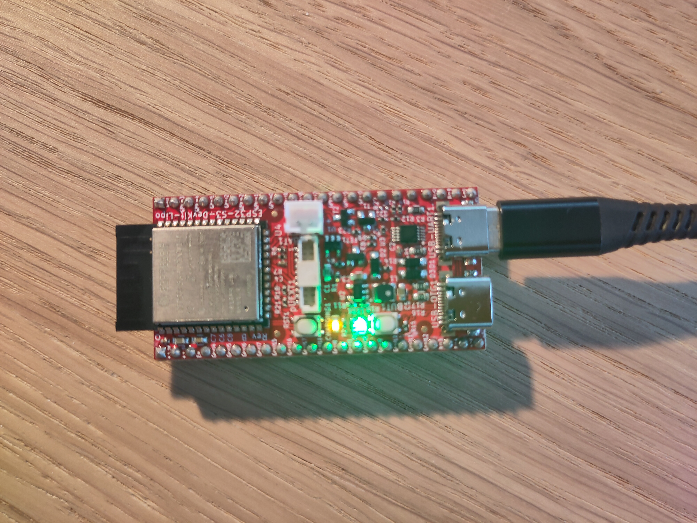

# AlphaSmart Neo2 Buddy

You bought a Neo2 because the blank page on a laptop is a trap. No tabs. No notifications. Just keys, a small screen, and whatever story is stubborn enough to show up.

The catch is the ending of the writing day: getting those files *off* the machine without turning the ritual into IT support. That’s what this project is for.

**Neo2 Buddy** is a little ESP32-S3 sidekick that sits next to your Neo. Plug in, and it can:

- back up your AlphaWord files over USB  
- show live typing in a browser on your phone or laptop  
- pass Neo keystrokes through Bluetooth to another device  
- ship copies to the cloud (**WebDAV** or **S3**-compatible storage) when you want a second home for drafts  
- let another computer fetch backups automatically with a small **Python** tool  

Think of it as a quiet stagehand: the Neo stays the star; the Buddy handles the props.

The USB “manager” language the Buddy speaks was figured out largely by studying **[NeoTools](https://github.com/lykahb/neotools)** by [Borys Lykah](https://github.com/lykahb) (built on earlier work in [AlphaSync](https://github.com/tSoniq/alphasync/)). We stand on that research so you can keep typing.

Current release: **1.0.0-beta.1** in [`releases/1.0.0-beta.1/`](releases/1.0.0-beta.1/). Licensed under [GPL-3.0](LICENSE).

> **Beta — work in progress.** This project is early software. Expect rough edges, missing polish, and behaviour that may change between releases. Development and testing so far have used a **Dutch-market Neo2** only. **UK, US, and other regional keyboard layouts** may behave slightly differently — especially for live typing, Bluetooth passthrough, and text import/export. We have not been able to test on other regional variants yet. Bug reports and layout feedback are very welcome.

---

## Getting started

### What you need

| Item | Notes |
|------|--------|
| **ESP32-S3 board** | Must have a **dedicated USB OTG / host** data port (separate from the UART flash port). Typical boards cost about **€6–€15**. **8 MB flash** is recommended. Reference board: [Olimex ESP32-S3-DevKit-Lipo](https://www.olimex.com/Products/IoT/ESP32-S3/) (OTG1 = Neo data, other USB = CH340 serial). |
| **AlphaSmart Neo2** | With its USB-B device port |
| **Small USB power bank** | Needed so the Neo gets enough **5 V / current** on USB-B to detect a USB connection. AA batteries alone are **not** enough for USB/emulation. |
| **Custom USB cable** | Split harness: USB-B → Neo, USB-A (you could also use USB-C, but it might get a bit confusing as it could match the cable of the ESP32) → power bank, USB-C or Micro-USB (depending on your ESP32 board) → ESP32 OTG (I recommend a local thriftshop for these, wouldn't want to cut open the only USB-B cable you have) |
| **Phone or laptop** | For the local web portal over Wi‑Fi |
| **ESP-IDF 5.3.1** | Install this first if you build or use the project flash scripts |

Optional: microSD card reader (preferred for backups), OLED screen (shows IP / status / live typing). I currently didn't pay the extra for it but there might be an ESP32 board with OTG and mobile network on board, would require some additions to the firmware, but you would be able to back up anywhere.

---

### 1. Build the custom cable

You need three connectors in one harness:

| Connector | Goes to |
|-----------|---------|
| **USB-B** | AlphaSmart Neo2 |
| **USB-A** | Power bank (5 V supply) |
| **USB-C or Micro-USB** | ESP32 **OTG / host** port (not the UART/CH340 flash port) |

**Wire it like this** (standard USB colours):

| Wire | Connect |
|------|---------|
| **Red** (VBUS / +5 V) | Power bank USB-A → Neo USB-B only. Do **not** feed Neo 5 V through the ESP32. |
| **White** (D−) and **green** (D+) | ESP32 OTG (USB-C / Micro-USB) ↔ Neo USB-B |
| **Black** (GND) | All grounds tied together (power bank + ESP32 + Neo) |

```text
Power bank ──USB-A──┐
                    ├─ red ──────────────────────────► Neo USB-B  (+5 V)
                    │
                    └─ black ──┐
                               ├─ common GND ─────────► Neo USB-B + ESP32 OTG
ESP32 OTG ──USB-C/µUSB─────────┤
                    white/green┘──────────────────────► Neo USB-B  (D− / D+)
```

**Why the power bank?** The Neo only enables USB / transfer mode when USB-B has real **5 V**. A small bank supplies that. With 5 V on USB-B and the ESP32 on D+/D−, the Neo switches into USB mode (hot-plug works — no Neo reboot required).


More detail: [docs/neo2-usb-wiring.md](docs/neo2-usb-wiring.md).


---

### 2. Install ESP-IDF 5.3.1

Install **[ESP-IDF v5.3.1](https://docs.espressif.com/projects/esp-idf/en/v5.3.1/esp32s3/get-started/)** first (Windows installer or clone). This project targets that version.

On Windows, the helper scripts expect IDF under `C:\Espressif\frameworks\esp-idf-v5.3.1`. Before flashing from PowerShell you can also load:

```powershell
cd firmware
. .\idf_env.ps1
```

---

### 3. Flash the firmware

#### Option A — Prebuilt release (easiest)

```powershell
cd releases\1.0.0-beta.1
python -m esptool --chip esp32s3 -b 460800 --before default_reset --after hard_reset write_flash --flash_mode dio --flash_size 8MB --flash_freq 80m 0x0 bootloader.bin 0x8000 partition-table.bin 0xf000 ota_data_initial.bin 0x20000 alpha_smart_neo2_buddy.bin 0x420000 littlefs.bin
```

Adjust the COM port if your esptool needs `-p COMx`. Use the board’s **UART / CH340** USB port for flashing, not OTG1.



#### Option B — Project flash script (build + flash)

```powershell
cd firmware
.\flash.ps1 COM3              # build and flash
.\flash.ps1 COM3 -Monitor     # flash then open serial monitor
.\flash.ps1 COM3 -ManualBoot  # Olimex: hold BUT1, tap RST1, release BUT1, then Enter
```

#### Option C — Build from source

```powershell
cd firmware
. .\idf_env.ps1
idf.py set-target esp32s3   # once per build tree
idf.py build
idf.py -p COMx flash monitor
```

The portal files in `firmware-web/` are packed into `littlefs.bin` at build time.

---

### 4. First portal setup

1. Power the buddy. Join its Wi‑Fi hotspot (name starts with **Neo2**).
2. Open [http://192.168.4.1](http://192.168.4.1) (or the address on the OLED if fitted).
3. Complete setup: **Direct access** or **Home network**, and set a **portal password** (8+ characters).
4. After reboot, sign in with that password.
5. Plug in the power bank → Neo USB-B, and the ESP32 OTG data cable.
6. In the portal, use **Backup now**.

On home Wi‑Fi: `http://<device-name>.local` (mDNS), e.g. `http://neo2-buddy.local`.

Default password after a fresh flash / factory reset (until you finish setup): `neo2buddy`.

### Try the portal before you flash

A **static showcase** with sample Neo documents, backups, SmartApplets, and live typing runs on GitHub Pages — no hardware required:

| Page | Demo URL |
|------|----------|
| Documents (backups, file scan, applets) | [riktastic.github.io/Neo2Buddy](https://riktastic.github.io/Neo2Buddy/) |
| Typing & Bluetooth | […/typing.html](https://riktastic.github.io/Neo2Buddy/typing.html) |

Enable **GitHub Pages → GitHub Actions** in the repo settings once; the [pages workflow](.github/workflows/pages.yml) publishes `firmware-web/` on each push to `main`. Local preview: `python -m http.server` in `firmware-web/` and open `/?demo=1`. Details: [docs/portal-showcase.md](docs/portal-showcase.md).

You can also manage the buddy from the **serial console** (same Wi‑Fi / Neo commands as the portal, plus `device wifi connect` and other maintenance). Connect to the CH340 UART port at **115200** baud after flashing:


In-device guide (portal footer): [/user-guide.html](firmware-web/user-guide.html).

---

## Features

### Local backups

- **Backup now** — changed AlphaWord files only, then returns Neo to keyboard mode.
- **Backup all** — every non-empty file, then returns to keyboard mode.
- Blank/whitespace docs are skipped; identical text already on the buddy is not saved again.
- Prefer an SD card when present; otherwise files go on internal flash. Flash may prune oldest `.txt` files when space runs low. **SD card files are never deleted by that prune or by factory reset.**

**Keyboard mode note:** Scan / Read / Write / Backup switch Neo into **manager mode** and pause live typing. Backup now/all return to keyboard automatically. A single Read/Download/Scan may need **Keyboard mode** afterward.

### Live typing

While Neo is in keyboard mode, the portal (and UART / OLED) show what you type.

### Bluetooth keyboard passthrough

Pair the buddy once (**Pair keyboard**, 2-minute window). While connected, **Neo keys are typed on the phone/PC**. Bonds persist across reboot. Portal **Send text** / **Send BLE** can still paste longer text to the same host.

### Cloud sync (WebDAV & S3)

Optional upload of local backups to the cloud. Configure in the portal under **Cloud sync** (or via the Python CLI):

| Provider | Examples |
|----------|----------|
| **WebDAV** | Nextcloud, ownCloud, many NAS boxes |
| **S3-compatible** | AWS S3, Cloudflare R2, Backblaze B2, MinIO |

- Test the connection first (**Test connection**).
- Local copies stay on the buddy; upload **never deletes** them.
- Optional: **Auto cloud upload after backup**.
- Home Wi‑Fi with internet is required; S3 also needs a valid clock (SNTP).

Details: [firmware/docs/cloud-sync.md](firmware/docs/cloud-sync.md).

### Python wrapper (pull backups from another device)

Talk to the buddy over the network from a PC — same API as the portal. Useful for scheduled backup pulls, scripts, or an always-on home server.

```powershell
cd python-wrapper
pip install -e .

neo2buddy status
neo2buddy backup --pull .\backups          # backup Neo, then download .txt files
neo2buddy backup --mode all --pull .\backups
neo2buddy pull .\backups                   # download existing local backups only
neo2buddy sync config --provider webdav --enabled on --endpoint https://... --folder neo
neo2buddy sync test
neo2buddy sync run
```

Library:

```python
from neo2buddy_wrapper import Neo2BuddyClient

with Neo2BuddyClient("192.168.4.1", password="your-password") as buddy:
    result = buddy.backup_and_pull("./backups", mode="changed")
    print(result["downloaded"])
```

Point the client at the buddy’s LAN IP or `http://neo2-buddy.local` when on home Wi‑Fi. Full CLI/API: [python-wrapper/README.md](python-wrapper/README.md).

---

## Package a release

```powershell
.\firmware\scripts\package-release.ps1 -Version 1.0.0-beta.1
```

Unit tests:

```powershell
idf.py -C test set-target esp32s3
idf.py -C test build
```

---

## Future ideas / wishlist

These are not implemented yet — notes for later work and for anyone wanting to contribute.

### More cloud destinations

WebDAV and S3-compatible storage work today. Other writing-focused destinations would be nice too — for example syncing into the **[Hammer](https://hammer.ink)** ecosystem ([Hammer editor](https://github.com/Darkrock-Studios/hammer-editor) / hammer.ink sync) so Neo drafts can land closer to where novels are edited.

### Faster Neo USB timings

The USB flip / dialogue timeouts and message framing were largely taken from **[NeoTools](https://github.com/lykahb/neotools)**. That keeps us compatible, but Neo2 might tolerate tighter timings. Worth experimenting carefully so backups and file I/O feel snappier without breaking enumeration.

### Simpler cable: USB-B ↔ USB-C only (~€6)

A cheap USB-B to USB-C cable would replace the custom three-ended harness — **if** Neo USB-B still gets a steady **5 V**. Options that preserve a mostly stock Neo:

| Approach | Trade-off |
|----------|-----------|
| External power bank (current) | Works, no Neo modification; one extra device |
| Power Neo USB-B from the Neo’s own battery pack | What [Danny Salzman](https://www.dannysalzman.com/2024/06/20/modding-alphasmart-neo-for-wireless-ble-transfer) did for his BLE mod — reliable 5 V on the port, but means opening / wiring inside the Neo |
| **Back-panel USB-A “light/lamp mod”** | Some people already wire Neo battery pack → the rear USB-A for a light. That same 5 V could feed **USB-B**, which would remove the need for an external power bank while leaving the Neo looking stock from the outside |
| Keep the split harness | Safest for an unmodified Neo |

Preference for this project: keep the Neo as original as possible; prefer external or already-modded lamp wiring over cutting into a clean unit.

### Smaller / custom buddy board

Many ESP32-S3 modules are tiny. A purpose-built board (or compact carrier) could pack USB host, optional SD, and Wi‑Fi into something that sits under or beside the Neo without a full DevKit. Needs hardware design skills — interesting long-term idea for a single compact setup.

---

## Repository map

| Path | What it is |
|------|------------|
| `firmware/` | ESP-IDF firmware (Neo USB, services, HTTP API) |
| `firmware-web/` | Browser portal (HTML/CSS/JS) → LittleFS image; [live showcase on GitHub Pages](docs/portal-showcase.md) |
| `python-wrapper/` | Remote CLI / library (`neo2buddy_wrapper`) |
| `releases/` | Flashable binaries |
| `docs/` | Hardware / wiring notes and [portal screenshots](docs/portal-showcase.md) |
| `firmware/docs/` | Neo USB, cloud sync, limits |
| `specs/` | Product behaviour (kept current) |

`firmware/main/web/` is the **C HTTP API**, not the SPA. Edit UI in `firmware-web/`.

---

## Credits & references

- **[NeoTools](https://github.com/lykahb/neotools)** ([PyPI](https://pypi.org/project/neotools/), [lykahb](https://github.com/lykahb)) — primary reference for understanding Neo USB enumeration, the HID→comms flip, framed manager messages, file/applet I/O, and dialogue timings. Much of this project’s Neo protocol behaviour was figured out by studying NeoTools.
- **[AlphaSync](https://github.com/tSoniq/alphasync/)** — earlier Mac Neo file manager whose USB driver NeoTools ported from.
- **[Danny Salzman’s Neo BLE mod](https://www.dannysalzman.com/2024/06/20/modding-alphasmart-neo-for-wireless-ble-transfer)** — practical notes on Neo USB power and ESP32 companions.

---

## More reading

- **[Portal showcase (live demo)](docs/portal-showcase.md)** — GitHub Pages preview with sample data; UART screenshot
- [User guide (source)](firmware-web/user-guide.html)
- [Neo USB wiring (detailed)](docs/neo2-usb-wiring.md) — cable photos and signal routing
- [Neo USB & backup](firmware/docs/neo-usb-and-backup.md)
- [Cloud sync](firmware/docs/cloud-sync.md)
- [Python wrapper](python-wrapper/README.md)
- [NeoTools](https://github.com/lykahb/neotools)
- [Product spec](specs/001-alphatouch-buddy/spec.md)
- [Neo module map](firmware/main/neo/README.md)
