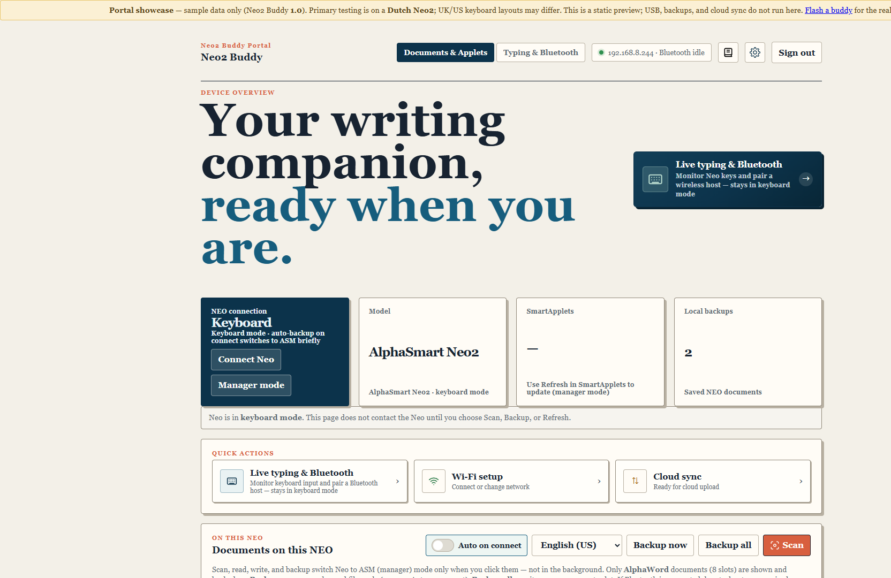
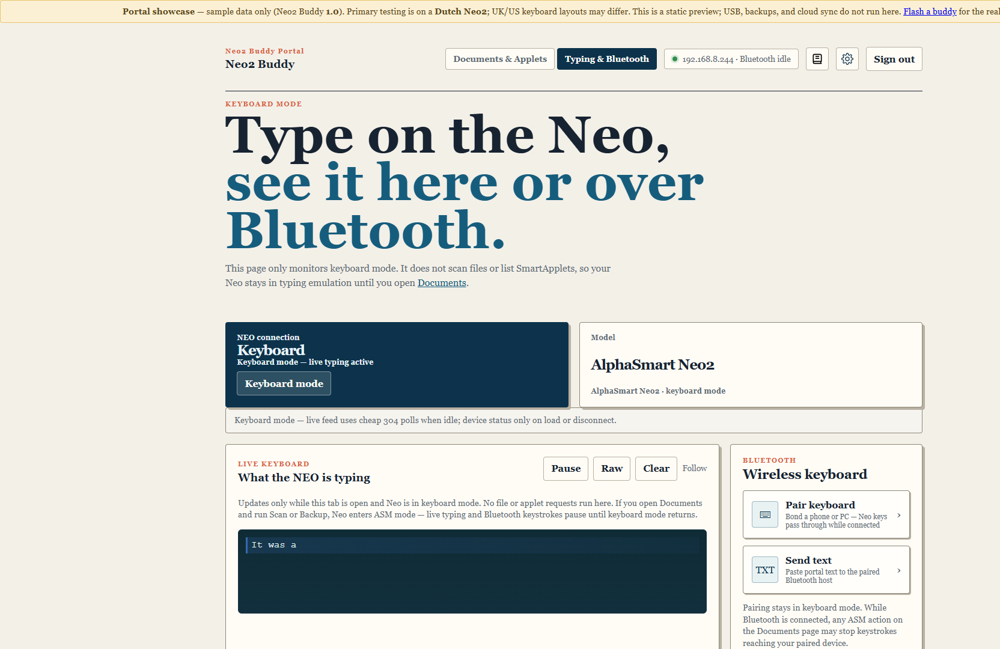
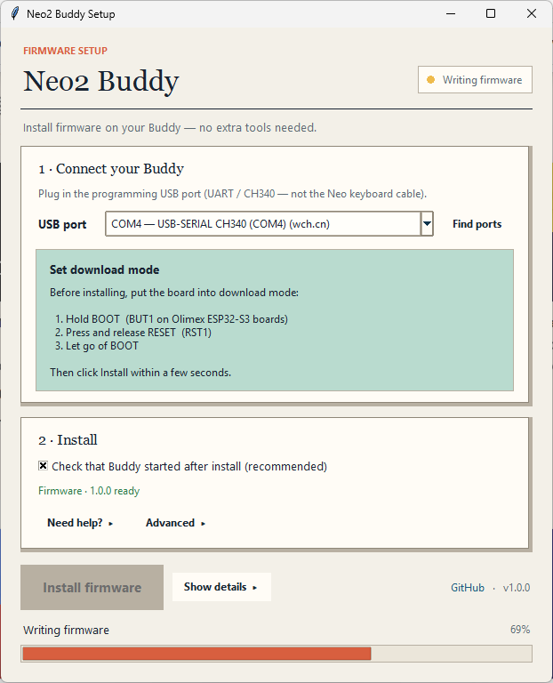

# Neo2 Buddy

The AlphaSmart Neo2 is a wonderful writing machine: a real keyboard, a small screen, and nothing else. No tabs. No notifications. Just your words.

**Neo2 Buddy** is a small add-on you plug in when you want the rest — backups, Bluetooth typing, a live preview on your phone — then unplug. The Neo stays a Neo.

**[Try it out — click through the portal](https://riktastic.github.io/Neo2Buddy/)** (sample data, no hardware)

[Typing & Bluetooth](https://riktastic.github.io/Neo2Buddy/typing.html) · [Release 1.0.0](https://github.com/Riktastic/Neo2Buddy/releases)

## The portal, before you buy a thing

This is the page that lives on the Buddy’s Wi‑Fi. The live demo is the same UI, filled with sample files so you can see if it feels right.

  <a href="https://riktastic.github.io/Neo2Buddy/"><strong>Open the visual demo →</strong></a>

## Why go to the trouble?

The Neo is great at *writing*. It is awkward at *finishing the day*: getting files off the machine, typing into a laptop, or keeping a second copy somewhere safe.

Typical parts are a **€6–€15** ESP32-S3 board, a **power bank** you may already own, and a **custom USB cable** (often spliced from thrift-store leads). If you already did the popular **USB lamp mod** (battery positive to the rear USB-A port), you may skip the power bank — [cable guide](docs/cable.md).

Unplug the Buddy and nothing about the Neo has changed.

## What you get

- **Backups of AlphaWord files** over USB — changed files, or everything. Plug in and it can do this by itself, then put the Neo back into typing.
- **Live typing** on your phone or laptop while you write on the Neo.
- **Bluetooth keyboard** — Neo keys appear on a computer or tablet.
- **A second copy in the cloud** if you want — this project recommends [Hammer Ink](https://hammer.ink/); Nextcloud, a NAS, or S3-style storage also work.
- **A simple web page** on your home Wi‑Fi or the Buddy’s own hotspot.

## Make one

1. **[What to buy](docs/getting-started.md)** — board, cable, 5 V for the Neo’s USB port.
2. **[The cable](docs/cable.md)** — USB-B to the Neo, data to the Buddy, power from a bank (or the lamp mod).
3. **[Put firmware on the board](docs/flashing.md)** — download **Setup** from the [release](https://github.com/Riktastic/Neo2Buddy/releases) (`Setup-windows`, `Setup-macos`, or `Setup-linux`). Unzip and run it; no extra software. The app walks you through preparing the ESP32.

Then join the Buddy Wi‑Fi, open [http://192.168.4.1](http://192.168.4.1), set a password. Day-to-day: **[Using Neo2 Buddy](docs/using.md)**.

## Guides

[Getting started](docs/getting-started.md) · [Cable](docs/cable.md) · [Flashing](docs/flashing.md) · [Using it](docs/using.md) · [Troubleshooting](docs/troubleshooting.md) · [All docs](docs/README.md)

Applet Store installs are paused in 1.0.0 while stock applets are retested. Flash Cards decks still work. Tested mainly on a **Dutch Neo2**.

[GPL-3.0](LICENSE) · Independent project — [not affiliated with AlphaSmart / Renaissance](docs/credits.md)
