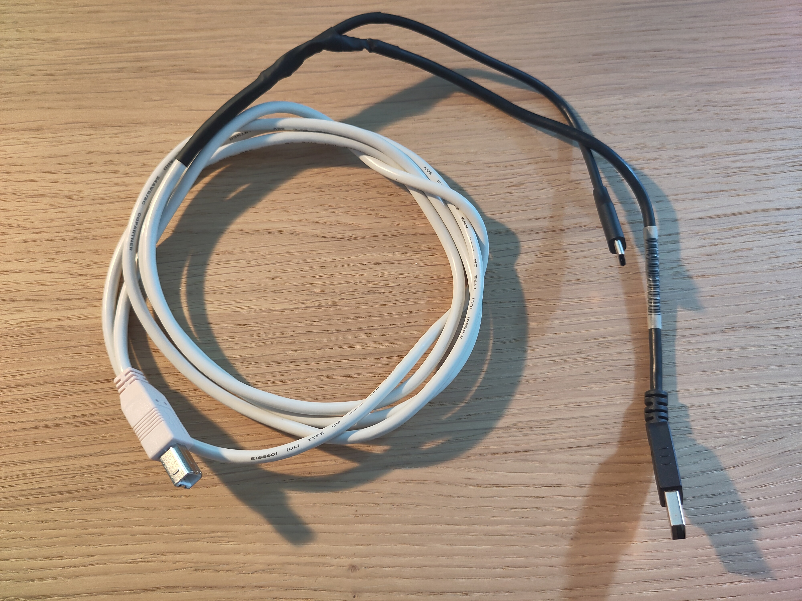
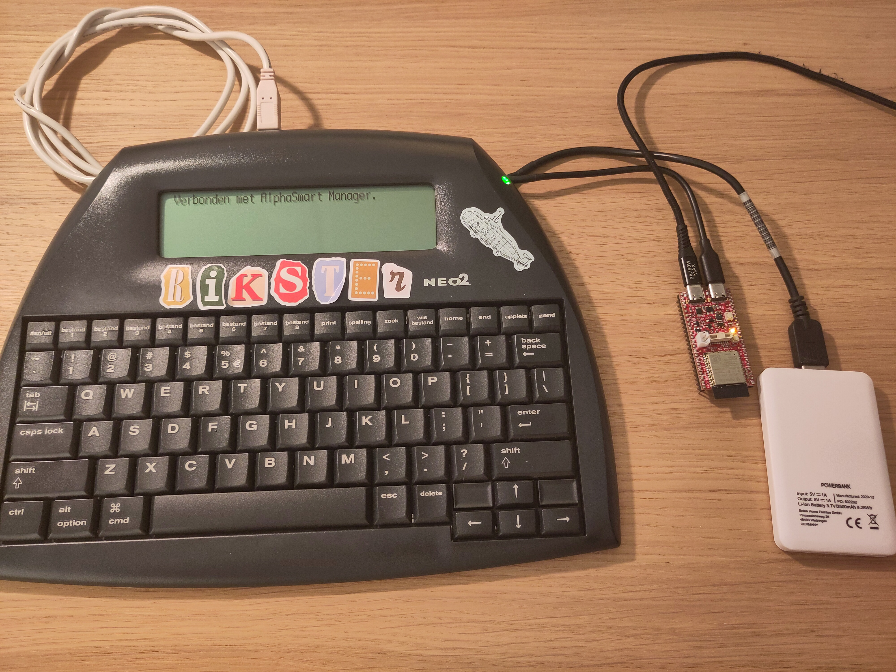

# Cable and power

The Neo2 only starts USB “talking” when its **USB-B** port sees **5 V**. The three AA cells inside will run the keyboard and screen. They will **not** wake USB by themselves.

That is why there is a cable (or a small inside-the-Neo wiring job). It is the one fiddly part of the project. After it exists, you just plug in.



## What the cable must do

Three jobs, three connectors:

| Plug | Goes to |
|------|---------|
| **USB-B** (square) | AlphaSmart Neo2 |
| **USB-A** | Power bank (5 V) — skip this if you power USB-B another way (below) |
| **USB-C or Micro-USB** | ESP32 **OTG / host** port — **not** the port you used to install firmware |

On the Olimex ESP32-S3-DevKit-Lipo, **OTG1** is the Neo data port. The other USB is the serial/flash port.

### How to splice it (standard USB colours)

| Wire | Connect |
|------|---------|
| **Red** (+5 V) | Power bank → Neo USB-B **only**. Do not feed that 5 V through the ESP32. |
| **White** (D−) and **green** (D+) | ESP32 OTG ↔ Neo USB-B |
| **Black** (ground) | Power bank, ESP32, and Neo **all joined** |

```text
Power bank ──USB-A──┐
                    ├─ red ──────────────────────────► Neo USB-B  (+5 V)
                    │
                    └─ black ──┐
                               ├─ common ground ──────► Neo USB-B + ESP32
ESP32 OTG ──USB-C/µUSB─────────┤
                    white/green┘──────────────────────► Neo USB-B  (data)
```

A USB-C lead on the power-bank side is easy to mix up with the ESP32 cable. USB-A for the bank is less confusing.

Thrift-store cables are ideal. Do not cut the only USB-B lead you own.

### Why a power bank?

With 5 V on USB-B and the ESP32 on the data wires, the Neo notices a USB host and switches into transfer mode. You do **not** need to reboot the Neo. Plug the data path in while you are writing and it switches on the spot.

Use a bank that stays at 5 V under load. One bank feeding Neo + ESP32 is usually fine.



## The USB lamp mod

A lot of Neo2 owners already opened the case for a **desk-light mod**: a wire from the **positive battery terminal** to the **rear USB-A** port (the one meant for a small USB lamp / “printer” accessory). Then a USB-A lamp runs from the AA pack.

If you have that mod, you already solved “there is power on a USB port of this Neo.” You can:

- Keep using a **power bank on USB-B** (no extra Neo surgery; this is the default Buddy recipe), or
- Use the **same idea** to put battery power on **USB-B** as well, so the Buddy does not need an external bank.

That second option means opening the Neo again and being careful with grounds and that you still only have **one** 5 V (or battery) source on USB-B. AA packs are a bit under a PC’s 5 V; the Neo mainly needs *voltage present* on USB-B to enable USB. This project prefers **not** cutting into a stock Neo — the split cable + power bank leaves the machine original.

[Danny Salzman’s Neo BLE notes](https://www.dannysalzman.com/2024/06/20/modding-alphasmart-neo-for-wireless-ble-transfer) describe powering the USB port from inside the Neo for a similar reason.

## Safety

- **One power source to the Neo USB-B.** Do not join a power bank’s red wire to the ESP32’s 5 V output.
- **Common ground is required.** If black is not shared, USB data is flaky or dead.
- Data must go to **OTG**, not the UART/CH340 flash port.
- For a cable you will keep: strain relief and tape/heat-shrink on splices. A small fuse on the Neo 5 V line is a nice extra.

## If the Neo never shows up

1. USB-B really has power (power bank LED on, or your lamp-mod path).
2. White/green go to **OTG**, not the flashing port.
3. Grounds are common.
4. The Buddy is powered and already flashed.

More: [Troubleshooting](troubleshooting.md).
