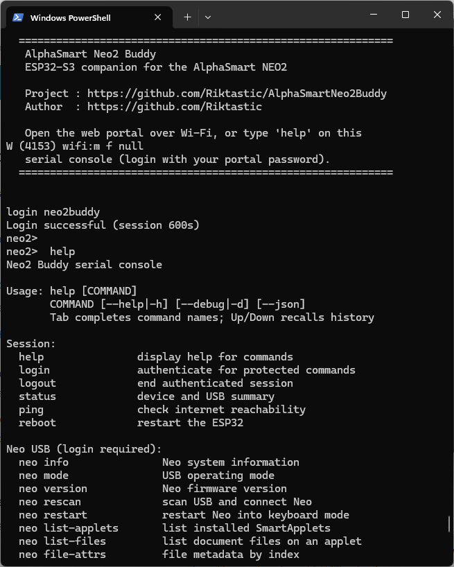

# Portal showcase (live demo)

> **Beta showcase.** The portal and firmware are work in progress. Testing so far is on a **Dutch Neo2** only; UK/US keyboard layouts may differ slightly for live typing and BLE.

The Neo2 Buddy **web admin portal** is a browser UI served from the ESP32 over Wi‑Fi. You can explore a **static showcase** with sample data before flashing hardware.

## Screenshots

**Web portal** — use the [live GitHub Pages demo](#live-demo-github-pages) below (Documents + Typing & BLE with sample data), or run locally with `?demo=1`.

**Serial console (UART)** — connect to the CH340 port at **115200** baud after flashing. Sign in with `login <portal-password>`, then `help` for Neo USB and device commands:



Hardware photos (split cable and bench setup): [neo2-usb-wiring.md](neo2-usb-wiring.md) · [README getting started](../README.md#1-build-the-custom-cable)

## Live demo (GitHub Pages)

After [GitHub Pages](https://docs.github.com/en/pages/getting-started-with-github-pages/configuring-a-publishing-source-for-your-github-pages-site) is enabled for this repository (**Settings → Pages → Build and deployment → GitHub Actions**), the portal is published from `firmware-web/` on each push to `main`:

| Page | URL |
|------|-----|
| **Documents** (backups, Neo files, SmartApplets) | `https://riktastic.github.io/Neo2Buddy/` |
| **Typing & Bluetooth** (live viewer, BLE pairing) | `https://riktastic.github.io/Neo2Buddy/typing.html` |
| **User guide** | `https://riktastic.github.io/Neo2Buddy/user-guide.html` |

Demo mode activates automatically on `*.github.io`. Sample content includes:

- Neo connected in **keyboard mode** with live typing animation
- Four **documents on the Neo** and two **local backups**
- Four **SmartApplets** (AlphaWord + language applets)
- **Cloud sync** configured (WebDAV example — test/upload are no-ops)
- **Settings** and Wi‑Fi scan examples

Nothing talks to real USB or cloud services in the showcase.

## Local preview

From the repo root:

```powershell
cd firmware-web
python -m http.server 8080
```

Open:

- [http://localhost:8080/?demo=1](http://localhost:8080/?demo=1) — Documents dashboard  
- [http://localhost:8080/typing.html?demo=1](http://localhost:8080/typing.html?demo=1) — Typing & BLE  

Append `?demo=1` on localhost so `js/demo.js` enables mock API responses. On a real buddy (`192.168.x.x` or `*.local`), demo mode stays off.

## How it works

| File | Role |
|------|------|
| `firmware-web/js/demo.js` | Intercepts `/api/v1/*` `fetch` calls with sample JSON when demo mode is on |
| `firmware-web/index.html` | Documents dashboard (`data-page="dashboard"`) |
| `firmware-web/typing.html` | Live typing + Bluetooth (no manager-mode polling) |
| `.github/workflows/pages.yml` | Publishes `firmware-web/` to GitHub Pages |

The portal avoids background Neo manager commands: status polls use `/status` only (no applet list or `/command/info` while in keyboard mode). A contextual banner appears when Bluetooth is connected, warning that ASM actions may pause BLE keystrokes.

The same files are packed into the device **LittleFS** image at firmware build time; `demo.js` is harmless on hardware (it no-ops on LAN hosts).

## Real device vs showcase

| | Showcase | Real buddy |
|---|----------|------------|
| Sign-in | Auto (demo token) | Portal password you set at setup |
| Neo USB / backups | Sample lists only | Live over USB |
| Live typing | Animated sample text | Your Neo keystrokes |
| Cloud sync | Example config | Your WebDAV / S3 credentials |
| BLE pairing | Dialog UI only | Real NimBLE keyboard |

See [README — First portal setup](../README.md#4-first-portal-setup) to flash and connect hardware.
