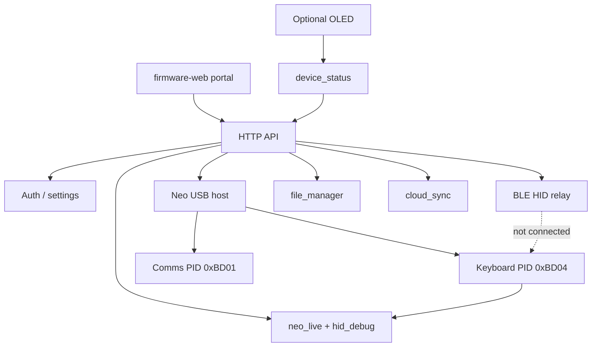

# Implementation Plan: AlphaSmart Neo2 Buddy

## Technical context (as shipped)

- **Firmware**: ESP-IDF 5.x, C, FreeRTOS (`firmware/`).
- **UI**: Local web portal (`firmware-web/` → LittleFS); optional SSD1306-class I2C OLED status (`HAVE_OLED`). No shipping LVGL/touch UI.
- **Connectivity**: Wi‑Fi AP/STA + mDNS; NimBLE HID keyboard (portal text relay); ESP-IDF USB host for Neo2.
- **Persistence**: NVS settings/auth/cloud; LittleFS portal + internal `/spiflash/neo` backups; optional FAT SD `/sdcard/neo`.
- **Neo protocol**: `firmware/main/neo/` — HID listen (`0xBD04`), flip to bulk (`0xBD01`), AlphaWord file I/O, autobackup, RESTART.
- **Cloud**: optional WebDAV / S3-compatible upload (`cloud_sync`).
- **Python client**: `python-wrapper/neo2buddy_wrapper/` remote API helper.

## Architecture

**Important:** There is no data path from Neo HID reports into BLE GATT. BLE send is portal/preview text → `ble_hid_device` → host.

## Delivery status vs original phases

| Phase | Original plan | Status |
| --- | --- | --- |
| Board bring-up | Round LCD + touch | Superseded: OLED + USB host Neo |
| Core services | NVS/LittleFS/status | Done |
| Touch shell | LVGL | Out of scope for shipping |
| Wi‑Fi onboarding | AP + portal setup | Done (+ mDNS, recovery AP) |
| Web portal | Status/files/settings | Done (+ Neo, live, cloud, guide) |
| BLE HID | Pair + type text | Done as **portal relay only** |
| Power | Battery/OLED | Done when hardware flags enabled |
| AlphaSmart | Experimental flag | Done: full USB Neo path + smart backup |

## API surface (representative)

| Area | Routes (prefix `/api/v1`) |
| --- | --- |
| Status | `GET /status` |
| Auth | `POST /auth/login`, `POST /auth/password`, … |
| Files | `GET/POST/DELETE /files…` |
| Neo | `/neo/files`, `/neo/autobackup`, `/neo/applets/…`, `/neo/rescan`, restart |
| Keyboard | `GET /keyboard/recent`, `GET /keyboard/raw`, `POST /keyboard/clear` |
| BLE | `/ble`, `/ble/pairing`, `/ble/preview`, `/ble/send`, `/ble/cancel` |
| Cloud | sync config / test / run |
| System | factory-reset, settings, Wi‑Fi |

Auth: owner password (hashed). State-changing routes require session/token after setup.

## Data model (current)

- Device settings: name, neo label, brightness/sleep, keyboard layout preference, auto-backup, auto-cloud, portal-auth flag.
- Wi‑Fi profiles (credentials never in GET responses).
- Auth: password hash + salt; first-run complete.
- Backups: UTF‑8 `.txt` on SD or flash.
- Device status: battery, Wi‑Fi/IP, BLE state, USB Neo connected/keyboard/comms/flipping, backup busy/phase.
- Cloud sync config + last health/test (NVS).

## Verification

- Unity tests under `firmware/test` (auth, blank-text helpers, etc.).
- `idf.py build` for production firmware.
- Hardware: Neo 5 V USB‑B, OTG1 data, OLED/SD optional, BLE pair + portal send, backup→keyboard return.
- Browser: mobile + desktop; confirm keyboard-interrupt dialogs and BLE scope copy.
- Release: `firmware/scripts/package-release.ps1 -Version <semver>` (Full + Setup zip).
  Lean profiles: `package-profiles.ps1` / Image Builder (`flasher/`).

## Risks and mitigations

- **Neo USB power**: document 5 V requirement; portal port hints.
- **Keyboard vs manager mode**: flip interrupts live typing; warn in UI + confirm; RESTART after backups.
- **BLE**: Neo→BLE key passthrough while connected; NVS bonds for reconnect; portal text send optional.
- **Flash/SD space**: smart skip + prune on internal flash only.
- **Classroom pairing**: pairing window time-limited; toggle from portal.
